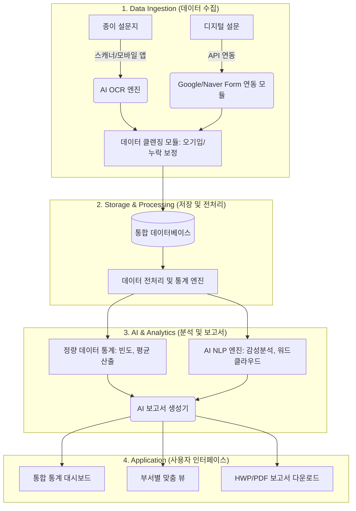

# 🏛️ 노인복지관 AI 만족도조사 자동화 플랫폼 설계안

## 1. 시스템 아키텍처 구조 (System Architecture)

전체 시스템은 수기 입력의 번거로움을 없애는 **자동 수집 파이프라인**, 데이터를 정제하는 **전처리 과정**, 그리고 인사이트를 도출하는 **AI 분석 및 시각화 계층**으로 구성됩니다.

### 아키텍처 상세 설명
* **Data Ingestion (수집 자동화)**: 고령층의 특성상 종이 설문지 비중이 높으므로, 복합기 스캔본이나 스마트폰 촬영본을 텍스트와 체크박스로 변환하는 고성능 **AI OCR (광학문자인식)**을 도입합니다.
* **데이터 클렌징**: AI가 '매우 만족'에 체크하고 주관식에는 부정적인 내용을 적거나, 한 문항에 중복 체크된 이상 데이터를 탐지하여 관리자에게 알림을 줍니다.
* **AI NLP (자연어처리) 엔진**: 주관식 문항에 대해 형태소 분석을 진행하여 긍정/부정 감성을 분류하고, 주요 건의사항을 워드클라우드 형태로 시각화합니다.
* **보고서 생성기 (Report Generator)**: 복지관에서 실제 사용하는 표준 결재 양식(HWP, PDF) 템플릿에 맞춰, 분석된 텍스트와 통계 차트를 자동으로 채워 넣어 초안을 완성합니다.

---

## 2. 사용자 시나리오 (설문 등록부터 보고서 출력까지)

현장 실무자의 업무 흐름을 따라 가장 최소한의 클릭으로 업무가 마무리되도록 설계된 시나리오입니다.

| 단계 | 수행 주체 | 상세 시나리오 | 부서별 적용 예시 |
|---|---|---|---|
| **1. 설문 등록** | 담당자 | 시스템에 접속하여 기존 템플릿을 불러오거나 새 문항을 구성합니다. 인쇄용 PDF 또는 온라인 링크(QR코드)를 발급받습니다. | **[평생교육팀]** 분기별 정규강좌용 '강사/환경 만족도' 템플릿 일괄 로드 |
| **2. 데이터 수집** | 참여자/담당자 | **[온라인]** 어르신들이 스마트폰으로 참여 시 실시간 연동. **[오프라인]** 수거된 종이 설문을 복합기에 넣고 스캔하면 특정 폴더를 통해 시스템이 자동 인식. | **[스마트복지팀]** 키오스크 교육 직후 태블릿으로 현장 설문 진행 |
| **3. 검수 및 정제** | 시스템/담당자 | OCR 인식률이 낮거나 이상치(중복 응답, 미기입 등)가 있는 데이터만 팝업으로 띄워 육안으로 확인 후 클릭하여 수정 (Human-in-the-loop). | **[전 부서 공통]** 흐리게 체크된 문항만 화면에서 원본 이미지와 대조 후 승인 |
| **4. 통계/시각화** | 시스템 | 문항별 빈도/평균이 자동 계산되고 대시보드에 실시간 반영됨. 주관식 답변은 긍정/부정으로 분류되어 워드클라우드로 변환. | **[지역복지과]** 후원자/자원봉사자 만족도 및 전년 대비 증감 추이 확인 |
| **5. 보고서 출력** | 담당자 | `[보고서 자동 생성]` 버튼 클릭. AI가 *"전체 만족도 95%로 전년 대비 3% 상승하였으나, 공간 협소에 대한 건의사항이 15건 도출됨"* 같은 요약 텍스트를 작성하여 **한글(HWP)** 문서로 제공. | **[전 부서 공통]** 내부 그룹웨어 기안에 첨부할 완성형 결과보고서 즉시 다운로드 |

---

## 3. UI/UX 대시보드 화면 구성안

대시보드는 **[직관적인 지표 확인], [부서별 맞춤 심층 분석], [원클릭 보고서화]**에 초점을 맞추어 디자인됩니다.

### 📊 메인 대시보드 (Global Dashboard) - 복지관 전체 조망
* **Top Navigation Bar**: 부서 선택 필터 (전체 / 스마트복지팀 / 평생교육팀 / 지역복지과), 기간 설정 필터, 사용자 프로필.
* **Summary Cards (최상단 하이라이트)**:
  * 👥 **총 참여자 수 및 응답률** (예: 1,250명 / 85%)
  * ⭐ **기관 전체 평균 만족도** (4.6 / 5.0)
  * 📈 **전월/전년 대비 증감률** (🔺 0.2p 상승)
* **Chart Area (중단 시각화)**:
  * **[부서별 만족도 비교 Bar Chart]**: 3개 부서의 주요 사업별 만족도를 나란히 비교.
  * **[연령대별 만족도 Pie/Donut Chart]**: 60대 / 70대 / 80대 이상 응답자 분포와 연령대별 만족도 차이 시각화.
* **AI Insight Area (하단 알림창)**:
  * 💡 *AI 요약 알림*: "평생교육팀 '스마트폰 기초반'의 만족도가 전월 대비 급증했습니다. 반면, 지역복지과 경로식당 식단에 대한 '메뉴 다양성' 개선 요구 키워드가 20% 증가했습니다."

### 📑 부서별 상세 뷰 (Department-Specific View) - 심층 분석
* **좌측 패널 (사업/강좌 리스트)**: 진행 중인 사업 목록과 각각의 실시간 응답률 및 평균 점수 리스트.
* **우측 패널 (상세 분석)**:
  * **방사형 차트 (Spider Chart)**: 강사 만족도 vs 시설 만족도 vs 프로그램 내용 만족도 비교.
  * **NPS (순수천고객지수) / 재수강 의향 게이지 차트**: 어르신들의 긍정적인 재참여 의사를 시각화.
  * **주관식 건의사항 워드클라우드**: '에어컨', '마이크 소리', '교재 글씨 크기' 등의 핵심 불편/건의 키워드를 크기별로 시각화하여 우선순위 파악 지원.
  * **감성 분석 타임라인**: 긍정적 리뷰(파란색)와 부정적 리뷰(빨간색)의 비율 추이 그래프.

### 📝 보고서 생성 팝업 (Report Generation Modal) - 문서화
* **Step 1**: 대상 사업 및 기간 선택 (예: 2026년 상반기 평생교육팀 정규강좌 만족도)
* **Step 2**: 보고서에 포함할 요소 체크박스 선택 (문항별 통계표, 교차분석 차트 이미지, 주관식 원문 리스트, AI 종합 의견 등)
* **Step 3**: 출력 양식 선택 (기관 표준 HWP 결재양식 / 발표용 PPT 요약본 / 보관용 PDF)
* **Action**: 하단의 커다란 파란색 `[AI 만족도 보고서 초안 생성]` 버튼 클릭. (약 10초 내 문서 생성 완료)
